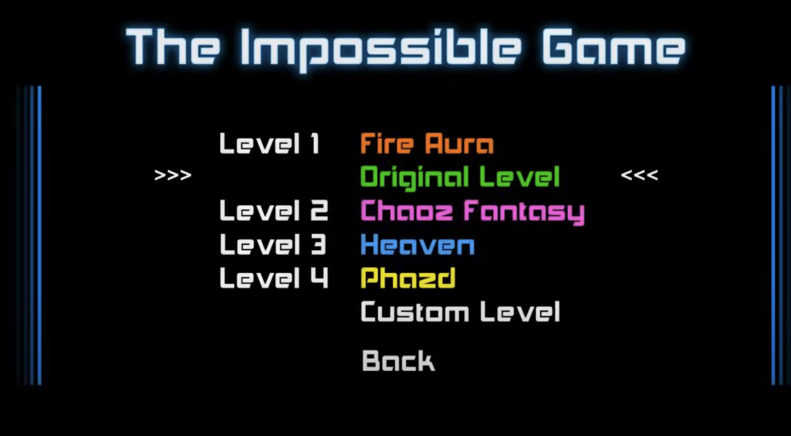

# Ohjelmistotekniikka, harjoitustyö

Valitsin aiheeksi **pelin** _The Impossible Game_.

##### Linkki laskareihin

https://github.com/tuheli/ot-harjoitustyo/tree/main/laskarit

##### Linkki työaikakirjanpitoon

https://github.com/tuheli/ot-harjoitustyo/blob/main/dokumentaatio/tyoaikakirjanpito.md

## Vaatimusmäärittely

### Sovelluksen tarkoitus

Sovellus on videopeli eli sen tarkoitus käyttäjän näkökulmasta on olla viihdyttävä.

### Käyttäjät

Sovelluksella on yksi käyttäjärooli: pelaaja.

### Käyttöliittymäluonnos

Käyttöliittymäluonnos perustuu pelistä otettuihin kuviin.

#### Pelaaminen kentässä

##### Pelaaminen kentässä - kuvan selitys:

- Keltainen neliö: pelaaja ilmassa hypyn aikana, etenee kentässä oikealle tasaisella vauhdilla.
- Musta neliö: Törmäämisestä sivuttain häviää pelin. Liikkuminen päällä on sallittu.
- Kolmio: osumisesta häviää pelin.
- Tumma lattiataso: osumisesta häviää pelin.
- Valkoinen lattiataso: liikkuminen päällä on sallittu.

#### Päävalikko

##### Päävalikko - kuvan selitys

- Ylimpänä pelin nimi
- Pelaajalle valittavana olevat kentät listana
- Kolme nuolta osoittaa valittuna olevaa kenttää
- Pelin lopetusnappi alimpana (kuvassa takaisin -painike)

Sovellus aukeaa päävalikkonäkymään, josta pelaaja voi valita pelattavan kentän tai sulkea sovelluksen. Kentän valitseminen johtaa pelaamisnäkymään kentässä.

### Pelin perustoiminnallisuudet

#### Yleiskuvaus

Pelihahmo eli neliö liikkuu tasaista nopeutta ruudulla oikealle. Pelaaja voi antaa syötteenä hyppykomennon ja oikein ajoitettuna estää törmäyksiä esteisiin tai putoamisen ei-sallitulle alueelle.

- Törmäyksien tunnistus kuvioiden välillä, tehty
- Pelaajan edistymisen tarkastelu: läpäistyt kentät ja montako yritystä kutakin kenttää kohden
- Kenttien lataaminen tiedostosta
